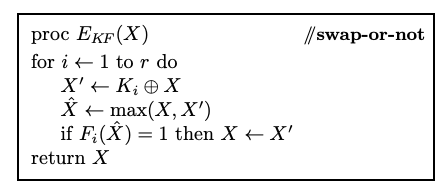
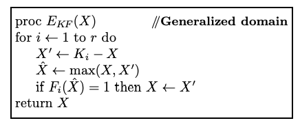

# 洗牌算法
https://link.springer.com/content/pdf/10.1007/978-3-642-32009-5_1.pdf  
"Card shuffling"过程的关键在于，它利用了随机的密钥和硬币抛掷来决定是否交换每一对牌的位置。这种过程类似于密码学中的"swap-or-not network"，通过随机的交换操作实现了对牌的重新排列，从而增加了洗牌的随机性和不可预测性。这个过程也可以用于构建密码系统，特别适用于解决格式保持加密等问题。
  
  
"swap-or-not network" 是一种密码构建方法，其过程可以概括为以下步骤：
1. 准备输入和密钥空间：首先，我们准备一个输入空间Ω，通常表示为 {0, 1} 的二进制序列。这个输入空间Ω可以看作是一副牌的排列方式，每个可能的排列都是Ω的一个元素。同时，有一个密钥空间K，用于生成随机密钥，K是一个有限集合。
2. 密钥生成：从密钥空间K中选择一个随机密钥K，这个密钥将用于加密和解密数据。
3. 轮函数选择：选择一系列轮函数F1, F2, ..., Fr，每个轮函数将输入空间Ω映射到一个单一的比特（0或1）。这些轮函数决定了每一轮中是否进行交换操作。
4. 加密过程：对于要加密的明文数据X，执行以下步骤：
- a. 初始化：将X作为当前数据，即X = X。
- b. 多轮加密：执行r轮的加密，每一轮如下：
  - i. 选择一个随机数Ki，这是从密钥K中派生的一个子密钥。
  - ii. 根据轮函数Fi和当前数据X，决定是否交换当前数据X和另一个数据Ki ⊕ X。具体来说，计算X和Ki ⊕ X的轮函数值，并根据这个值决定是否交换它们。
- c. 输出密文：最终的数据X就是加密后的密文。
5. 解密过程：解密时，使用相同的密钥K和相同的轮函数F1, F2, ..., Fr，以相反的顺序执行加密过程中的操作，即从r到1的逆序执行。这将还原密文为原始明文。  

   
"Card shuffling" 是一种将一副扑克牌洗牌的过程，这个过程与"swap-or-not network"密切相关。
1. 初始化牌堆：首先，我们有一副包含N张扑克牌的牌堆，每张牌都有一个唯一的标识或位置，通常用0到N-1的数字表示。
2. 密钥生成：从密钥空间K中选择一个随机密钥K，这个密钥将用于洗牌操作。K可以看作是一个随机的排列方式，表示牌的位置如何被重新排列。
3. 洗牌过程：执行以下步骤来洗牌牌堆：
- a. 选择一个随机数Ki，这是从密钥K中派生的一个子密钥。
- b. 对于每一对牌的位置X和K ⊕ X，执行以下操作：
  - i. 抛一枚公平的硬币，结果可以是正面（Heads）或反面（Tails）。
  - ii. 如果硬币结果为正面（Heads），则交换位置X和K ⊕ X上的牌；如果结果为反面（Tails），则保持位置不变。
- c. 重复上述操作多次，进行多轮洗牌。每一轮都使用不同的Ki和独立的硬币抛掷结果。
4. 输出洗牌后的牌堆：最终的结果是一个重新排列的牌堆，其中每张牌的位置经过多次洗牌后发生了变化。